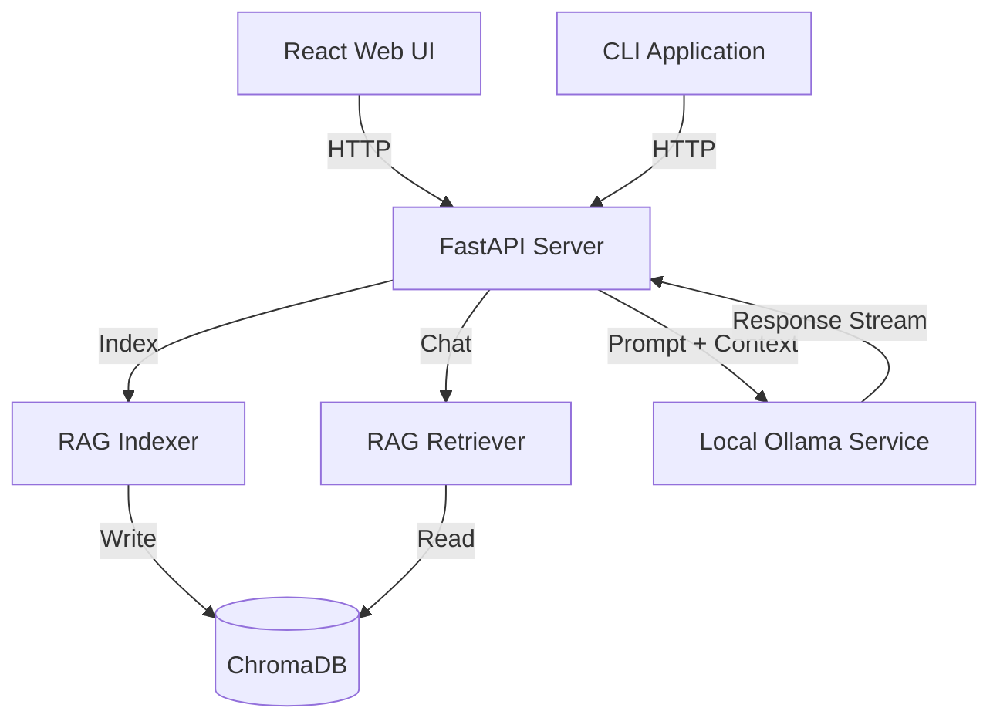

# System Architecture

## System Overview

The `local-ai-lab` is a local-only AI code explainer. It ensures complete privacy by running all components locally, avoiding external API calls to hosted LLMs. The system relies on:
- **FastAPI**: Serves the REST API.
- **ChromaDB**: A local vector database for fast Retrieval-Augmented Generation (RAG).
- **Ollama**: An external local service running large language models (`qwen2.5:3b`).

## Component Diagram

## Data Flows

### Indexing Flow
1. The user triggers an index request via the UI or CLI, providing a project path.
2. `core.rag.indexer` traverses the directory, splitting supported files into chunks.
3. Chunks are embedded using `all-MiniLM-L6-v2` and saved into ChromaDB.

### Chat Flow
1. The user submits a question and the active project root.
2. `core.rag.retriever` searches ChromaDB for the most relevant code chunks.
3. The API constructs a system prompt injecting the retrieved context.
4. The prompt is sent to the local Ollama instance, and the response is returned to the client.

## Decision Logging

The evolution of this architecture is tracked using Architecture Decision Records (ADRs). For a history of significant architectural changes, refer to the `docs/adr/` directory.
